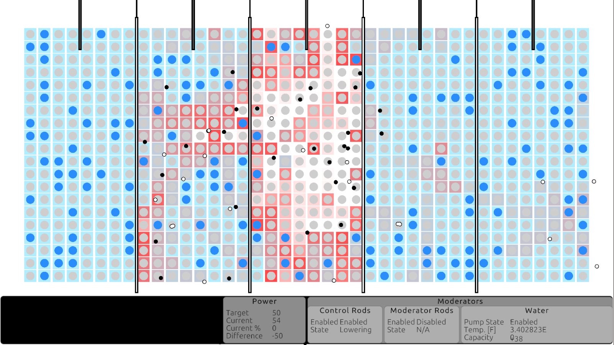

<!-- HEADER -->
# Nuclear Reactor Simulator

<!-- GETTING STARTED -->
## Getting Started

### 1. Unity Hub/Editor Setup

The Unity Game Engine Editor is required to run this project. It can be downloaded from the download page [here](https://unity.com/download). The download will prompt you to install the Unity Hub which is where you will select the version of the editor to install. This system was developed using editor version 6000.0.38f1.

1. Once the hub and editor are installed, click (Projects > Add) and add the project either from disk or from this repository.
2. Open the project and check that there are no errors showing in the console panel of the editor window.

### 2. Starting/Stopping the Simulating

The simulation is started and stopped all within the editor window, using the Play/Stop Play buttons near the top of the editor window.

### 3. Modifying the Simulation Variables

The simulation variables can be modified within the Inspector panel of the editor window. E.g., to edit the target power output of the reactor, click the Reactor Monitor gameobject and drag the Target Power slider up or down. 

<!-- GETTING STARTED -->
## Project Future

There are a number of quality of life as well as performance and design improvements that I would like to make to the system in the future. These include - and are not limited to:

- Improved memory management when handling large quantities of similar gameobjects
- Improved CPU performance with multithreading
- Improved graphics with higher resolution sprites
- User interface scaling to support multiple screen resolutions
